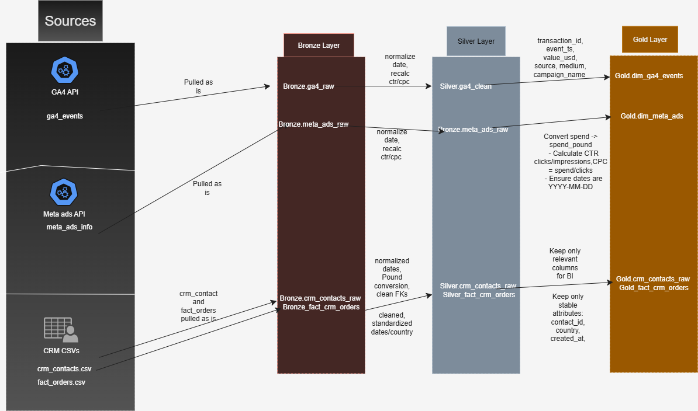
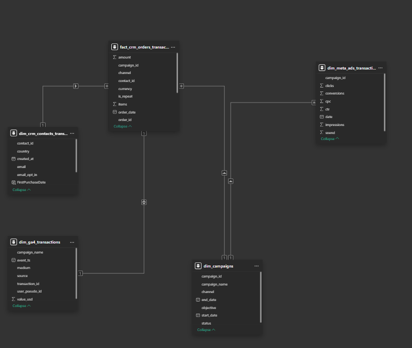
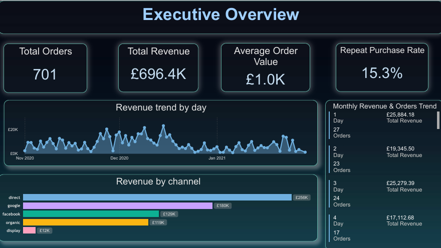
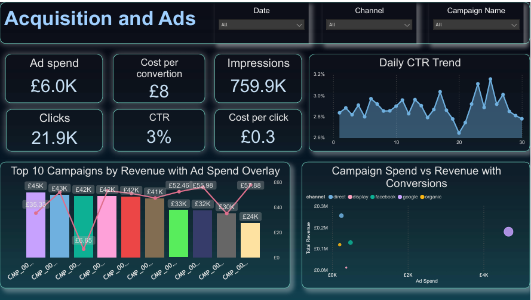
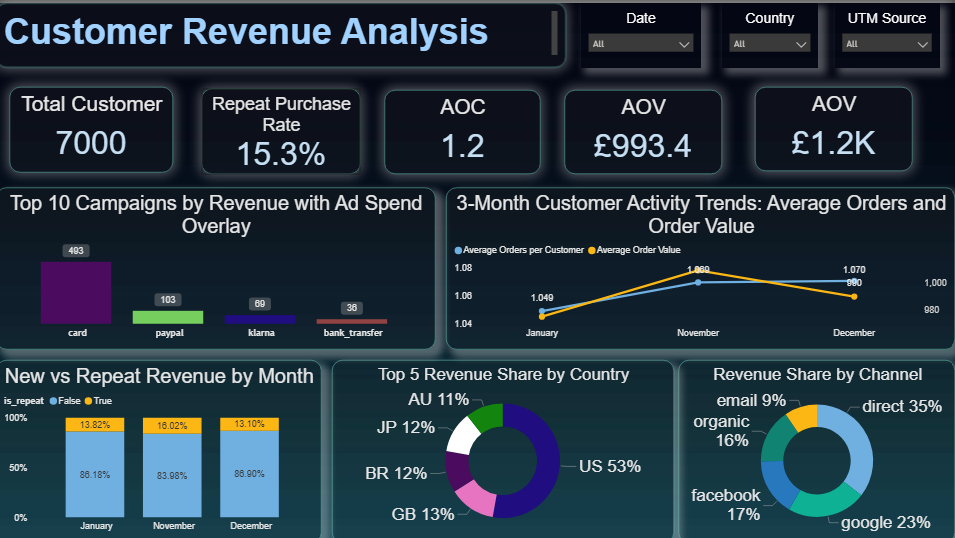

# Marketing & CRM Data Warehouse: End-to-End ETL and Analytics

Repository implements an end-to-end data warehouse and analytics pipeline. It ingests raw CRM CSVs, Meta Ads API data, and GA4 API data, lands raw extracts to a Bronze layer on Google Cloud Storage, standardizes and deduplicates in a Silver layer in BigQuery via dbt, and produces analytics-ready Gold tables consumed by Power BI.

---

## Table of Contents
1. [Project Summary](#project-summary)  
2. [Architecture Overview](#architecture-overview)  
3. [Integration Model](#integration-model)  
4. [Dataflow](#dataflow)  
5. [Data Mart](#data-mart)  
6. [Power BI](#power-bi)  
7. [Project Overview](#project-overview)  
8. [Technical Requirements](#technical-requirements)  
9. [Data Cautions and Limitations](#data-cautions-and-limitations)  
10. [Notes](#notes)

---

## Project Summary

Purpose: deliver observable, auditable, production-grade dataflows that provide revenue, campaign, and customer analytics.

Inputs: CRM CSVs, Meta Ads API, GA4 API.

Outputs: Gold star-schema tables and Power BI reports: Executive Overview, Acquisition and Ads, Customer Revenue Analysis.

Orchestration: Astronomer Airflow run in Docker. Transformation: dbt with BigQuery adapter. Storage: GCS for Bronze; BigQuery for Silver and Gold.

---

## Architecture Overview


Bronze Layer: Stores raw data as-is from the source systems. Data is ingested from CSV files into GCS using Airflow DAG.  
Silver Layer: This layer includes data cleansing, standardization, and normalization processes to prepare data for analysis.  
Gold Layer: Houses business-ready data modeled into a star schema required for reporting and analytics.

---

## Integration Model


---

## Dataflow



---

## Data Mart

Core objects

* fact_orders  
* dim_contacts  
* dim_campaign  
* dim_meta_ads  
* dim_ga4_events



---

## Power BI

Report tabs

* Executive Overview  
* Acquisition and Ads  
* Customer Revenue Analysis

1. Executive Overview



2. Acquisition and Ads



3. Customer Revenue Analysis



---

## Project Overview

Bronze

* Immutable raw extracts stored in GCS.

Silver

* dbt staging models that standardize timestamps and currency, deduplicate, and compute atomic metrics such as CTR, CPC, conversions.

Gold

* Business marts and star-schema tables for reporting. Incremental, auditable builds. DBT tests enforce uniqueness, not null, and referential integrity.

Design rules: use UTC timestamps, canonical column names, surrogate keys where required.

---

## Technical Requirements

Minimal environment

* GCP project with BigQuery and GCS  
* Service account JSON with BigQuery and GCS permissions; set `GOOGLE_APPLICATION_CREDENTIALS` to that key  
* Docker Compose or Astronomer CLI to run Airflow locally  
* Python 3.8+ for Airflow tasks and extractors  
* dbt with BigQuery adapter and configured `profiles.yml`  
* Power BI Desktop for report development

Quick start

```bash
export GOOGLE_APPLICATIONS_CREDENTIALS="yourpath"
# start Astronomer Airflow locally (or use docker-compose)
astro dev start
# trigger DAGs in Airflow UI: ingest_crm, ingest_meta_ads, ingest_ga4
cd dbt
dbt deps
dbt run --profiles-dir . --target prod
dbt test --profiles-dir . --target prod
```


---

## Data Cautions and Limitations

Data cautions and limitations

The data used here are expanded GA4 and Meta Ads samples created for pipeline validation. KPI values are illustrative and not for production decisions.

Synthetic ad-spend, impressions, and conversions do not reflect real-world economics. Treat ROAS and CAC as illustrative.

Sample expansion can disrupt source-level attribution. Validate transaction_id linkage between Silver and source tables before using campaign-level attribution.

Pre-production requirements: replace synthetic feeds with production data; rescale and validate dim_meta_ads.spend; add dbt tests on campaign+date joins and transaction counts; reconcile audit views to verify order counts and referential integrity.
---


